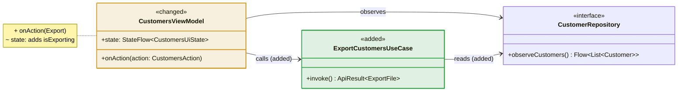
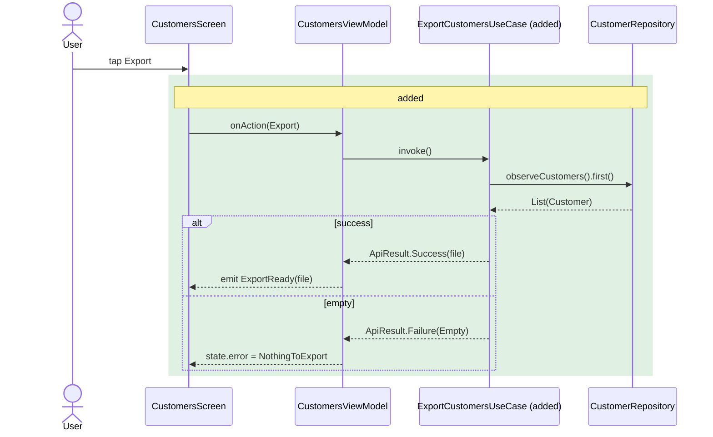

# System design

The as-built class and sequence design of the app, one file per module. Read it before designing a
change — a waterfall design (`.claude/waterfall/<slug>/02-design.md`) draws its diagrams from these
and highlights what it adds, changes and removes. The delivery that changes a module updates its
file here in the same diff, so this folder never describes code that no longer exists.

## Files

One file per module, named after its path: `feature/customers` → `feature-customers.md`,
`core/network` → `core-network.md`. A module with no file yet gets one from the first delivery that
touches it.

| Module | File | Flows |
|---|---|---|
| `core:domain` | [core-domain.md](core-domain.md) | Sign out |
| `core:network` | [core-network.md](core-network.md) | Authenticated request, token refresh on 401 |
| `core:security` | [core-security.md](core-security.md) | Encrypt and decrypt (Android, iOS) |
| `core:database` | [core-database.md](core-database.md) | Read and save the session, accept a pushed customer, apply a pulled page |
| `core:ui` | [core-ui.md](core-ui.md) | Edit and submit a form field |
| `core:utils` | [core-utils.md](core-utils.md) | Request a permission |
| `core:testing` | [core-testing.md](core-testing.md) | Typing in a ViewModel test |
| `feature:auth` | [feature-auth.md](feature-auth.md) | Sign in with email, social sign-in, sign up, sign out |
| `feature:customers` | [feature-customers.md](feature-customers.md) | Open the list, save, delete, sync, background retry (Android, iOS) |
| `feature:home` | [feature-home.md](feature-home.md) | Switch tabs and keep the account current |
| `feature:profile` | [feature-profile.md](feature-profile.md) | Load, upload avatar, save name, remove avatar, change password, sign out |
| `shared` (+ `androidApp`, `iosApp`) | [shared.md](shared.md) | Start the app, navigate |

<!-- One row per file, in module order: core:* first, then feature:*, then shared. -->

The platform shells (`androidApp`, `iosApp`) have no file of their own: they only call into
`shared`, and are drawn in `shared.md`.

Each file has this shape:

````markdown
# <module path, e.g. feature:customers>

<Two or three lines: what the module owns, and what it depends on.>

## Classes

```mermaid
classDiagram
    ...
```

## Sequences

### <Flow name, e.g. Load customers>

<One line: what starts it and what it ends in.>

```mermaid
sequenceDiagram
    ...
```
````

## What the diagrams show

- **Classes** — the module's ViewModels, `UiState`/`Action`/`Event` types, use cases, repository
  interfaces and implementations, APIs, DAOs, entities, DTO mappings and Koin module, with their
  public members as real Kotlin signatures. Screens appear as `<<composable>>` classes; small
  presentational components don't appear. Types from another module appear by name only, with
  their module in the stereotype (`<<core:domain>>`), and are drawn in full in their own file.
  A sealed type or enum lists its variants as members. When one diagram would be unreadable, split
  it by layer under `### Presentation`, `### Domain` and `### Data`; a type drawn in another of the
  module's diagrams appears there by name only.
- **Relationships** — `<|..` implements, `<|--` extends, `*--` owns, `-->` calls or depends on,
  `..>` creates or emits. Every arrow has a label saying which.
- **Sequences** — one per user-visible flow or background job, from the trigger (a user action, a
  scheduler) down through ViewModel → use case → repository → API or DAO → server, with real
  function names and return types. Failure branches (offline, timeout, 401, empty) are `alt`
  blocks; coroutine and thread hops (`viewModelScope`, the injected dispatcher) are notes. Messages
  never contain `<` or `>` — a renderer may strip them as HTML — so a generic is written
  `List(Customer)`, and `;` and `#` are avoided too.
- **Mermaid pitfalls** — a static member ends in `$` (`+MAX_PAGE_SIZE: Int$`, not `+MAX$: Int`); a
  method's text after `)` is its return type, so a remark goes after an em dash (`) Builder —
  androidMain`), never a second ` : `; a `note for` breaks lines with `<br>`, not `\n`. Stay within
  Mermaid 10.9 syntax — the version Android Studio's Mermaid plugin renders — and check a new
  diagram in that preview before saving it.

## Highlighting a change

Files in this folder show the code as it is and carry no highlights. A design's diagrams mark every
element it touches; anything unmarked exists today and is unchanged. The stereotype or label is the
marker — it reads in plain text and in any renderer; the colour comes from one `style` line per
marked class. Not `classDef`/`:::` — class diagrams only gained those in Mermaid 11, and the IDE's
Mermaid plugin bundles 10.9, where they fail the whole diagram.

| Change | Class diagram | Sequence diagram |
|---|---|---|
| Added | `<<added>>` and `style X fill:#2ea04326,stroke:#2ea043,stroke-width:2px` (green) | the steps inside `rect rgba(46,160,67,0.15)` with `Note over …: added`; a new participant's label ends in `(added)` |
| Changed | `<<changed>>` and `style X fill:#d2992226,stroke:#d29922,stroke-width:2px` (amber), plus a `note for` listing each member added (`+`), changed (`~`) or removed (`-`), one per line | `rect rgba(210,153,34,0.15)` with `Note over …: changed — <what>` |
| Removed | `<<removed>>` and `style X fill:#f8514926,stroke:#f85149,stroke-width:2px,stroke-dasharray:5 5` (red, dashed) | `rect rgba(248,81,73,0.15)` with `Note over …: removed` |
| Relationship | label suffix: `: calls (added)`, `: calls (removed)` | — |

Example:





When a delivery lands, the design's diagrams are copied here with the highlights stripped:
`<<added>>`/`<<changed>>` stereotypes, the `style` lines, change notes and `rect`
blocks go; `<<removed>>` elements are deleted; `(added)` suffixes are dropped.
