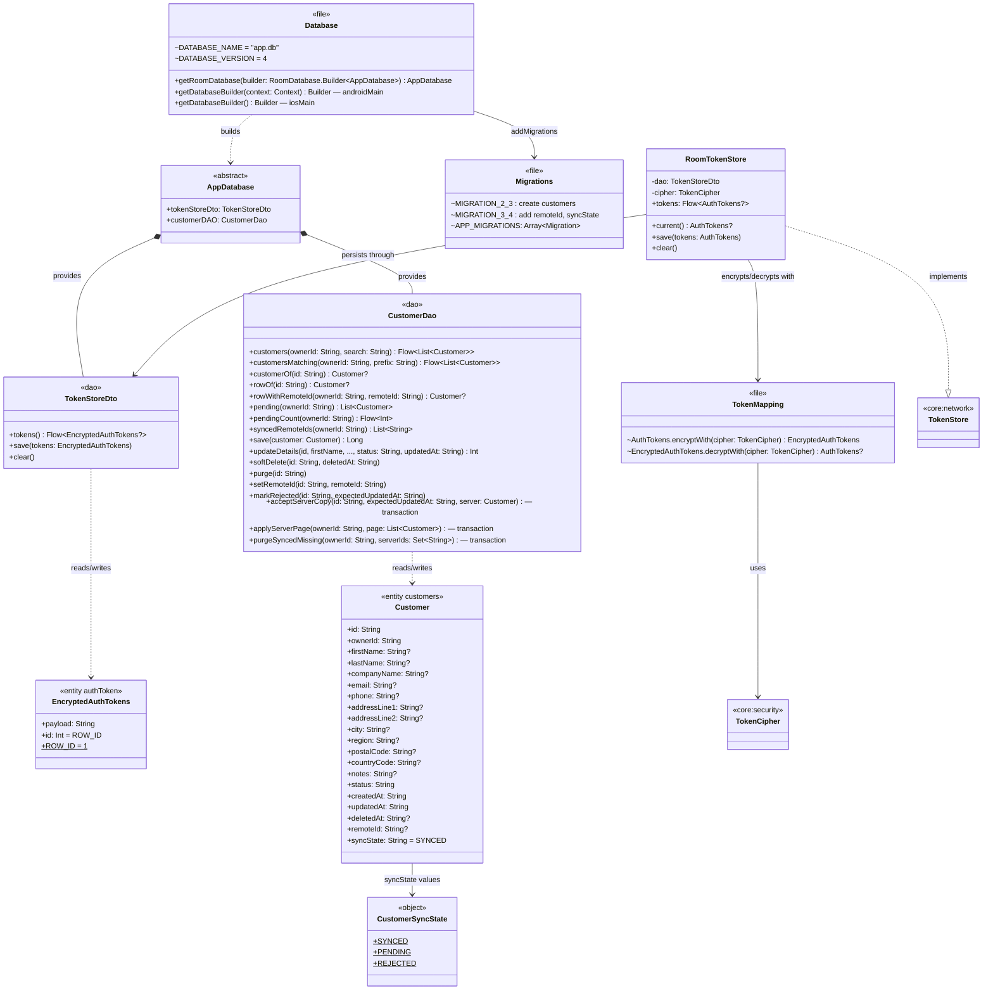
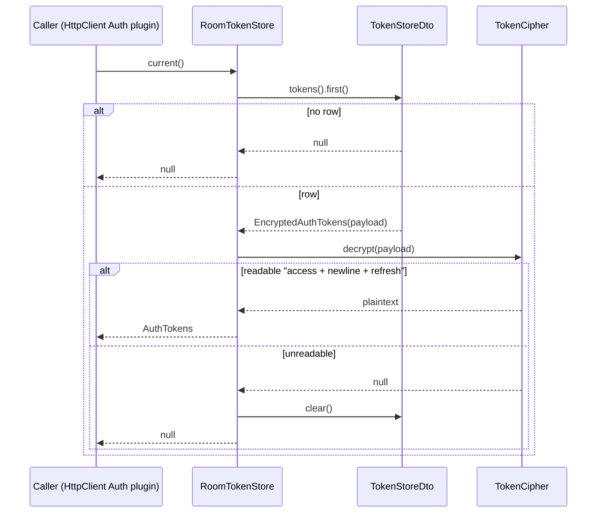
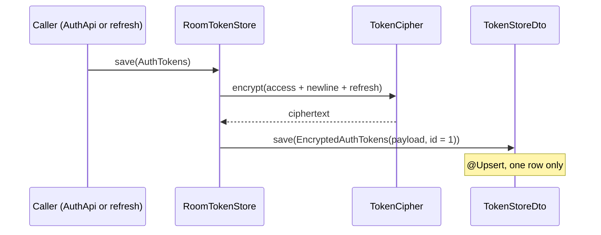
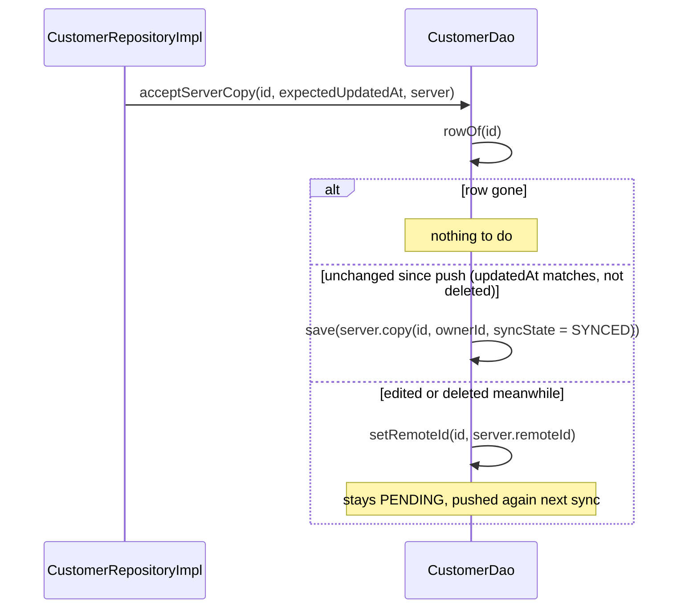
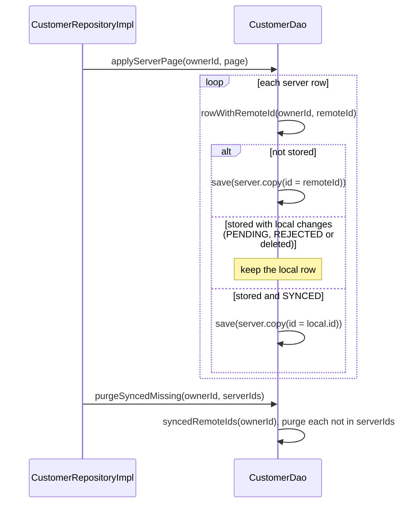

# core:database

Room 3 on SQLite (bundled driver): the encrypted session row behind `RoomTokenStore`, and the
`customers` table with its offline-sync bookkeeping. Exposes `core:network` and `core:security`
through `api`. Schema version 4, exported to `core/database/schemas/` and migrated, never wiped,
past version 2. `shared` builds the database per platform and binds the DAOs in Koin.

## Classes

## Sequences

### Read the session

What the HTTP client's `loadTokens` calls. An unreadable row (lost key, older build) is cleared, so
the user is signed out rather than stuck.

### Save the session

### Accept a pushed customer

`acceptServerCopy` only overwrites the local row if nobody edited it while the push was in flight.

### Apply a pulled page

