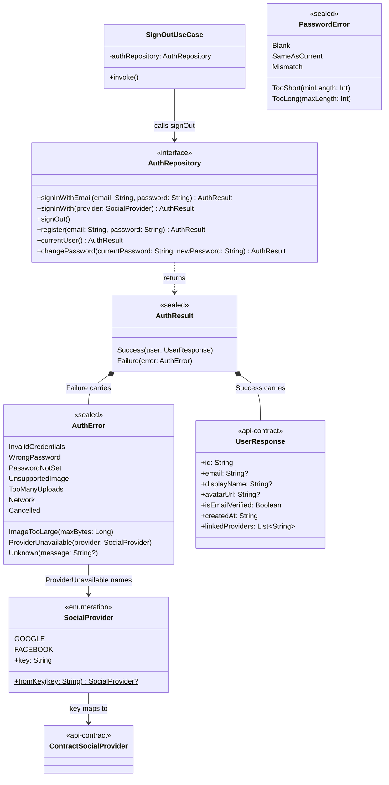
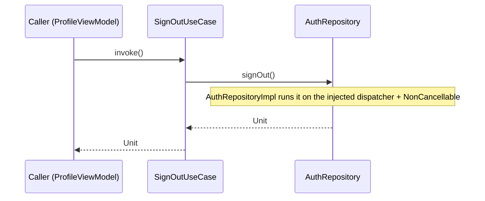

# core:domain

The account types every feature shares, the `AuthRepository` boundary and `SignOutUseCase`. Pure
Kotlin. Depends only on `api-contract`, whose `UserResponse` is the signed-in user end to end.
`AuthRepositoryImpl` lives in `feature:auth`; `FakeAuthRepository` in `core:testing`.

## Classes

## Sequences

### Sign out

`ProfileViewModel` (or any caller) signs out; the local session is gone whether or not the server
answered. The call continues even if the calling screen is torn down.

