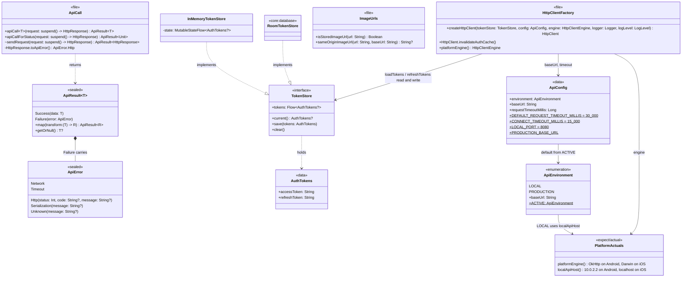
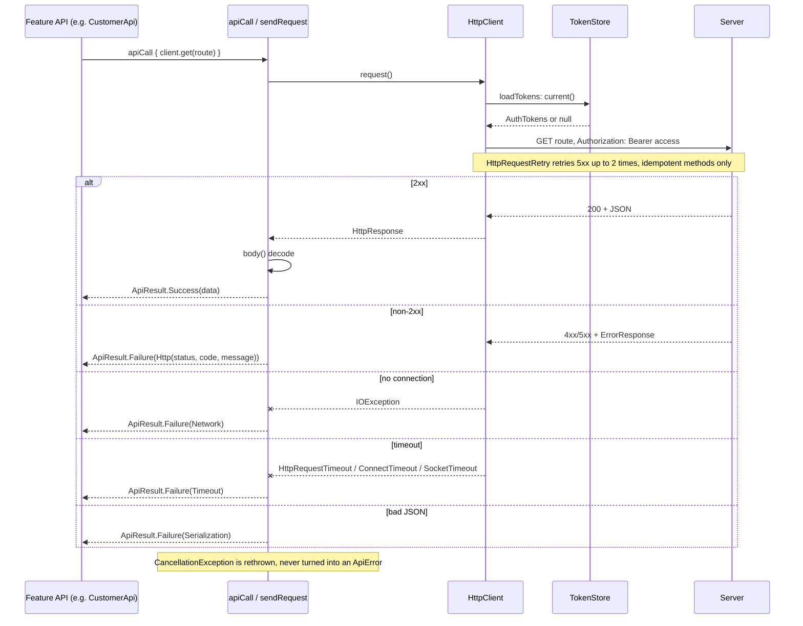
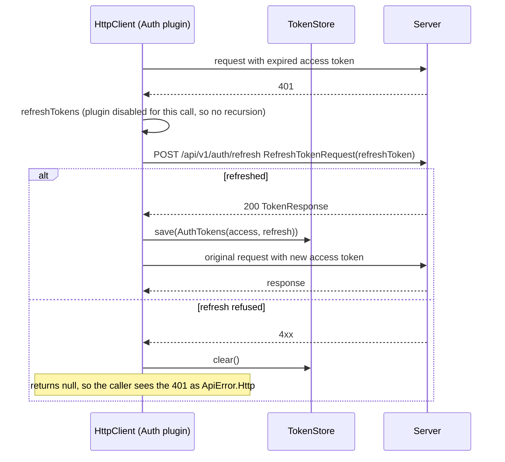

# core:network

Ktor plumbing every network-backed feature shares: the one `HttpClient` (bearer auth with refresh,
timeouts, retry, logging), `ApiResult`/`ApiError` and the single place an exception becomes an
`ApiError`, the `TokenStore` boundary, base-URL configuration and the avatar URL helpers. Exposes
Ktor core and coroutines through `api`; uses `api-contract` for routes and DTOs. Per-feature API
classes (`AuthApi`, `ProfileApi`, `CustomerApi`) live in their features.

## Classes

## Sequences

### Authenticated request

How every feature API call goes out and comes back as an `ApiResult`. Nothing above this layer
catches an exception.

### Token refresh on 401

The `Auth` plugin's bearer provider refreshes once, transparently to the caller.

