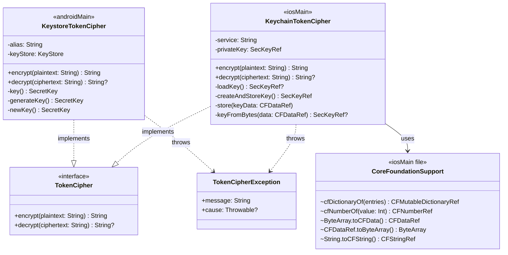
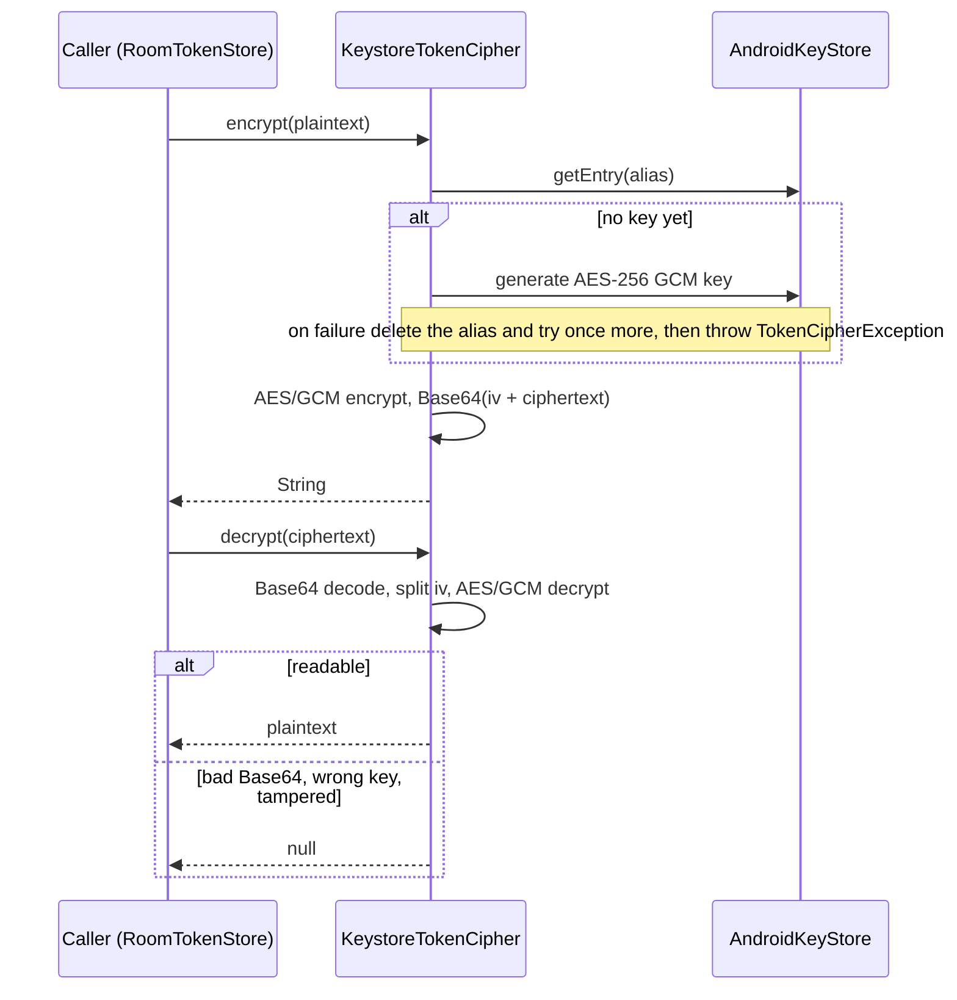
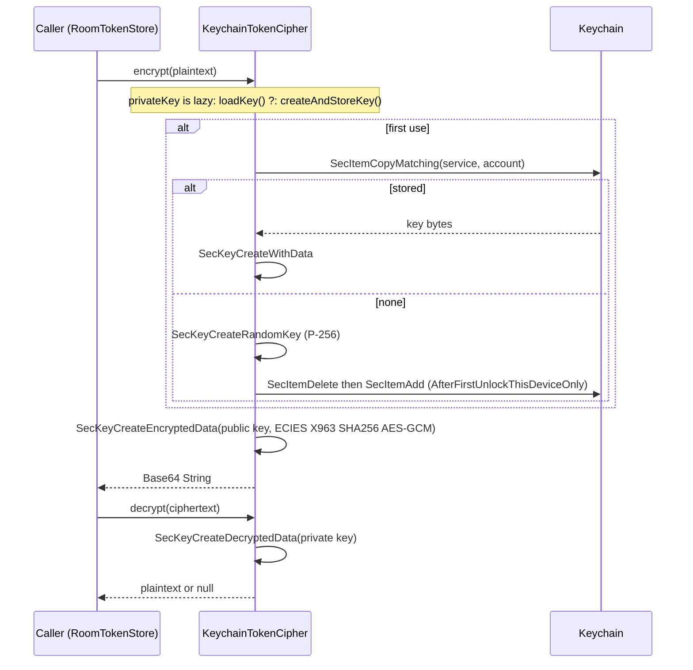

# core:security

The platform token ciphers: an AES-GCM key in the Android Keystore, and an ECIES key pair kept in
the iOS Keychain. No module dependencies. Used by `core:database`'s `RoomTokenStore`; `shared`
picks the cipher per platform.

## Classes

## Sequences

### Encrypt and decrypt (Android)

`encrypt` throws `TokenCipherException`; `decrypt` returns null for anything it can't read,
including a plaintext row from an older build.

### Encrypt and decrypt (iOS)

