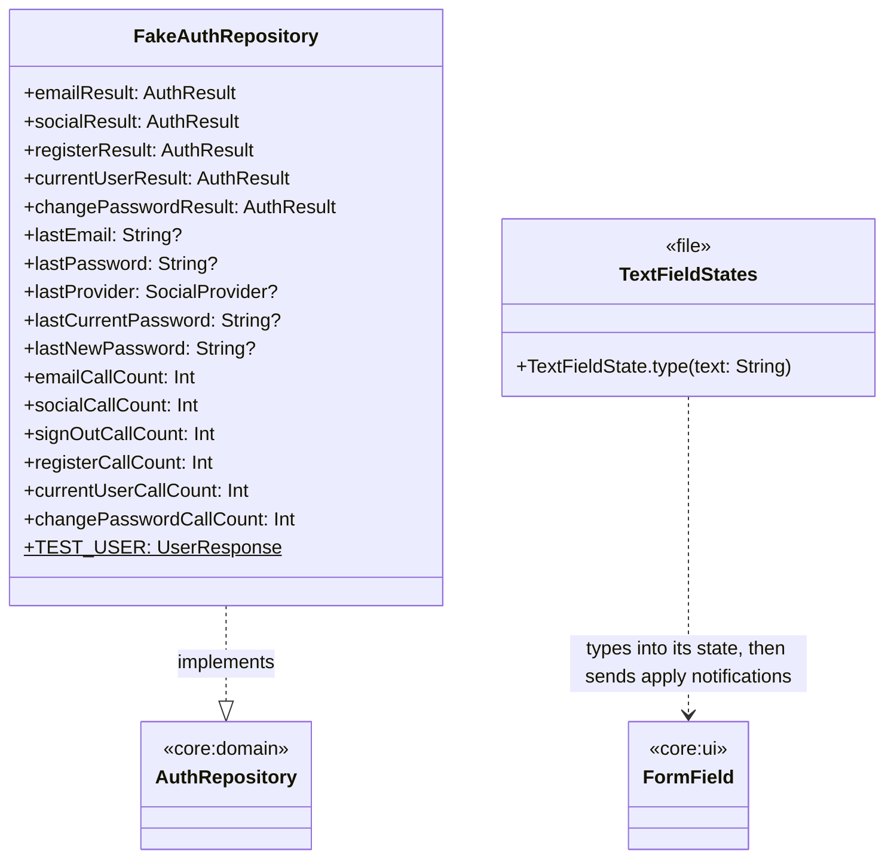
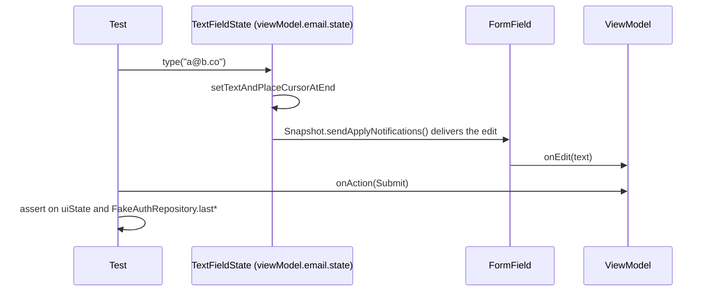

# core:testing

Test doubles more than one module's tests use. Only ever a `commonTest` dependency. Exposes
`core:domain` and Compose Foundation (for `TextFieldState`).

## Classes

## Sequences

### Typing in a ViewModel test

