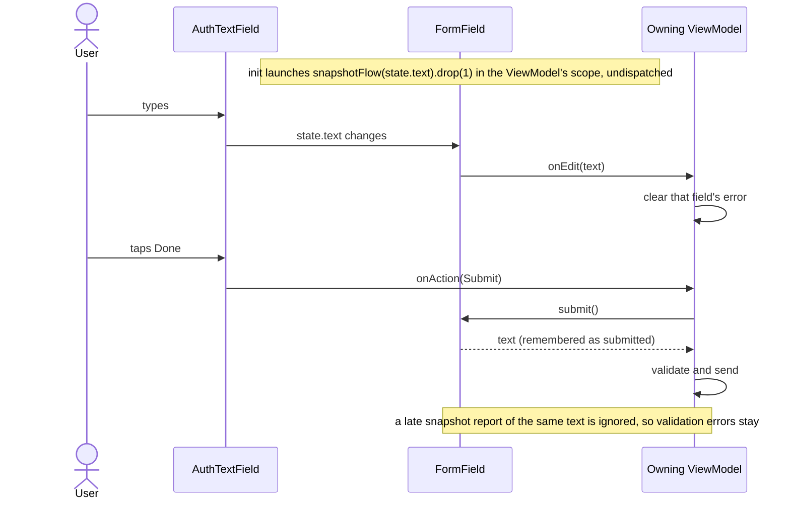

# core:ui

The design system every screen draws with: theme (`AppTheme`, colours, `Dimens`), modifiers, the
shared components, `FormField` (a ViewModel-owned text field), and the `asMessage()`/`asLabel()`
mappers for `core:domain`'s types. Its `Res` is public. Depends on `core:domain` (exposed) and
`core:utils`; uses Coil for `UserAvatar`.

## Classes

```mermaid
classDiagram
    direction TB
    class FormField {
        +state: TextFieldState
        -submitted: String?
        +FormField(scope: CoroutineScope, onEdit: (String) -> Unit)
        +submit() String
    }
    class AppTheme {
        <<composable>>
        +AppTheme(useDarkTheme: Boolean, content)
        +auroraColors: AuroraColors
        +LocalAuroraColors: CompositionLocal
    }
    class AuroraColors {
        <<data>>
        +backgroundTop, backgroundBottom: Color
        +blobPrimary, blobSecondary, blobTertiary: Color
        +glassFill, glassBorder, glassHighlight: Color
        +googleSurface, googleContent: Color
        +facebookSurface, facebookContent: Color
        +skeletonBase, skeletonHighlight: Color
    }
    class Dimens {
        <<object>>
        +space*, radius*, icon*: Dp
        +fieldHeight, buttonHeight, avatarSm, avatarLg: Dp
        +cardMaxWidth, screenPadding, compactWidthThreshold: Dp
    }
    class DomainMessages {
        <<composable file>>
        +AuthError.asMessage() String
        +PasswordError.asMessage() String
        +SocialProvider.asLabel() String
    }
    class UserIdentity {
        <<file>>
        +UserResponse.displayLabel() String
        ~UserResponse.signedInProvider() SocialProvider?
        +sampleUser(...) UserResponse
    }
    class PrimaryActionButton {
        <<composable>>
        +PrimaryActionButton(label: String, state: ActionButtonState, onClick, modifier, enabled)
    }
    class ActionButtonState {
        <<enumeration>>
        Idle
        Loading
        Success
    }
    class TextFields {
        <<composable>>
        +AuthTextField(state: TextFieldState, label, placeholder, leadingIcon, ..., errorMessage: String?)
        +AppOutlinedTextField(state: TextFieldState, ..., errorMessage: String?)
        +AppOutlinedSecureTextField(state: TextFieldState, ..., errorMessage: String?)
        +AppDropdownField~T~(options: List~T~, selected: T?, onSelect, optionLabel, ...)
    }
    class Surfaces {
        <<composable>>
        +GlassCard(...)
        +GlassSurface(...)
        +ContentColumn(...)
        +AnimatedAuthBackground(modifier)
        +SectionHeader(title: String, subtitle: String, modifier, style: SectionHeaderStyle)
        +StaggeredEntrance(visible: Boolean, index: Int, modifier, content)
        +rememberEntranceVisible() Boolean
    }
    class Lists {
        <<composable>>
        +AppList~T~(items: List~T~, modifier, key: ((T) -> Any)?, dividerStartInset: Dp, itemContent)
        +AppListItem(headline, supportingText, leadingIcon, trailing, onClick)
        +AppListDivider(modifier)
        +AppListDefaults
    }
    class Feedback {
        <<composable>>
        +ErrorBanner(error: AuthError?)
        +SkeletonBlock(...)
        +SkeletonLine(...)
        +SkeletonCircle(...)
    }
    class UserAvatar {
        <<composable>>
        +UserAvatar(user: UserResponse, modifier, size: Dp, textStyle)
        ~UserResponse.initials() String
    }
    class Modifiers {
        <<file>>
        +Modifier.handCursor(enabled: Boolean) Modifier
        +Modifier.pressScale(interactionSource, pressedScale: Float) Modifier
        +Modifier.shimmer(enabled: Boolean) Modifier
    }
    class AuthError {
        <<core:domain>>
    }
    class UserResponse {
        <<api-contract>>
    }

    AppTheme *-- AuroraColors : provides
    PrimaryActionButton --> ActionButtonState : renders
    TextFields ..> FormField : take its state
    Feedback --> DomainMessages : ErrorBanner shows asMessage
    DomainMessages --> AuthError : maps
    UserAvatar --> UserResponse : renders
    UserIdentity --> UserResponse : extends
    Surfaces --> AuroraColors : draws with
    Surfaces --> Dimens : sized by
```

## Sequences

### Edit and submit a form field

How a ViewModel-owned field reports edits (to clear a stale error) and hands its text to submit
without a late keystroke report wiping fresh validation errors.

