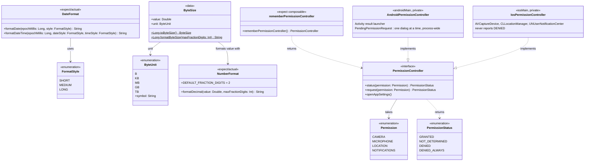
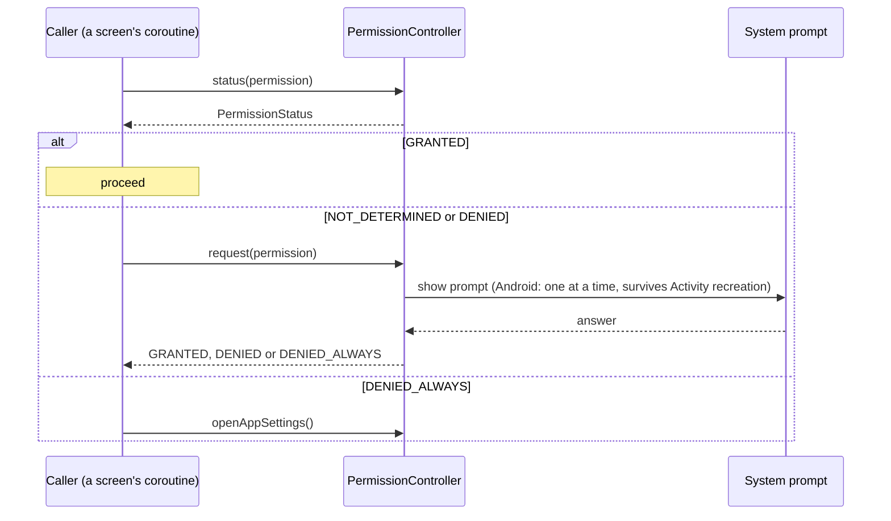

# core:utils

Platform helpers with no domain meaning: number, date and byte-size formatting in the device's
locale and time zone, and a runtime-permission controller. Depends on nothing in the project;
`androidx.activity.compose` on Android. A permission still has to be declared by the app (manifest
entry, `Info.plist` usage key) — none are yet.

## Classes

## Sequences

### Request a permission

