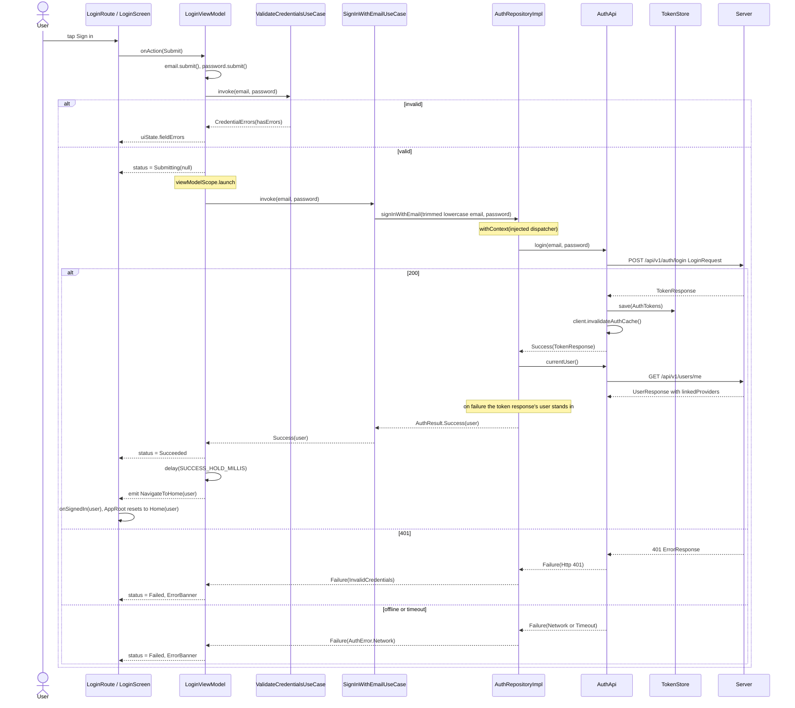
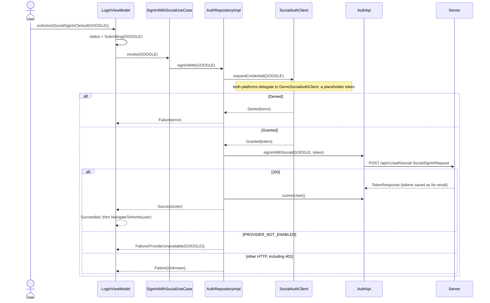
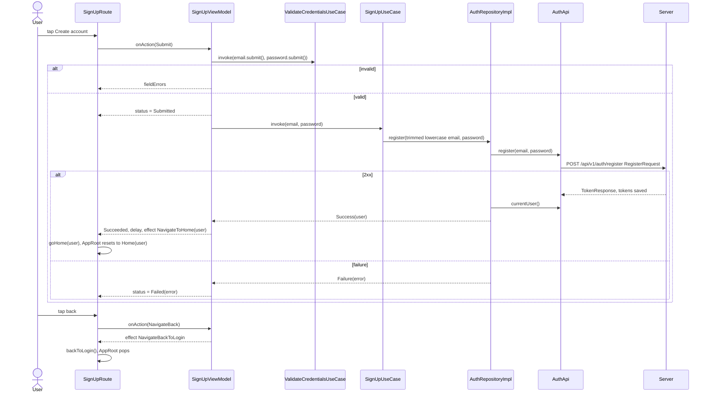
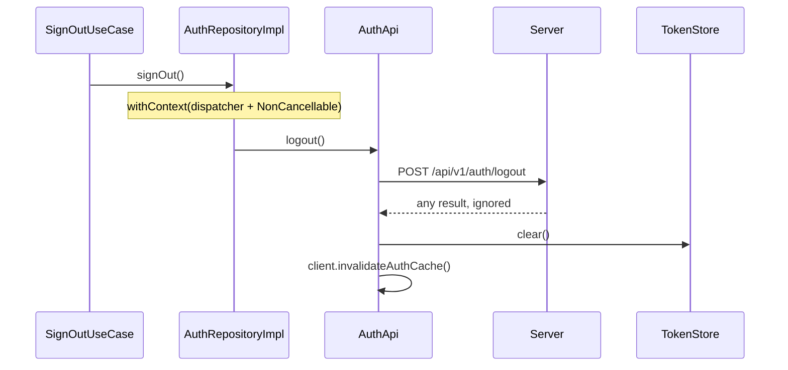

# feature:auth

Sign-in (email/password and social), sign-up, and `AuthRepositoryImpl` — the network-backed
implementation of `core:domain`'s `AuthRepository` that every other feature reaches through the
interface. Depends on `core:domain`, `core:ui`, `core:utils` and `core:network`. Screens report
`onSignedIn`/`onSignUp`/`goHome`/`backToLogin`; `shared`'s `AppRoot` navigates.

## Classes

### Presentation

```mermaid
classDiagram
    direction TB
    class LoginRoute {
        <<composable>>
        +LoginRoute(onSignedIn: (UserResponse) -> Unit, onSignUp: () -> Unit, modifier, viewModel: LoginViewModel)
    }
    class LoginScreen {
        <<composable>>
        +LoginScreen(state: LoginUiState, email: TextFieldState, password: TextFieldState, onAction, snackbarHostState, modifier)
    }
    class LoginViewModel {
        +uiState: StateFlow~LoginUiState~
        +events: SharedFlow~LoginEvent~
        +email: FormField
        +password: FormField
        +onAction(action: LoginAction)
        -submitEmailAndPassword()
        -submitSocial(provider: SocialProvider)
        -handle(result: AuthResult)
        -clearAfterSignIn()
    }
    class LoginUiState {
        <<data>>
        +isPasswordVisible: Boolean
        +fieldErrors: CredentialErrors
        +status: LoginStatus
        +isBusy: Boolean
        +isSubmittingEmail: Boolean
        +submittingProvider: SocialProvider?
        +error: AuthError?
    }
    class LoginStatus {
        <<sealed>>
        Idle
        Submitting(provider: SocialProvider?)
        Failed(error: AuthError)
        Succeeded
    }
    class LoginAction {
        <<sealed>>
        ScreenEntered
        TogglePasswordVisibility
        Submit
        SocialSignInClicked(provider: SocialProvider)
        ForgotPasswordClicked
        SignUpClicked
    }
    class LoginEvent {
        <<sealed>>
        NavigateToHome(user: UserResponse)
        ShowNotImplemented
        SignUpClicked
    }
    class SignUpRoute {
        <<composable>>
        +SignUpRoute(goHome: (UserResponse) -> Unit, backToLogin: () -> Unit, modifier, viewModel: SignUpViewModel)
    }
    class SignUpScreen {
        <<composable>>
        +SignUpScreen(state: SignUpUiState, email: TextFieldState, password: TextFieldState, onAction, modifier)
    }
    class SignUpViewModel {
        +state: StateFlow~SignUpUiState~
        +effect: Flow~SignUpEvent~
        +email: FormField
        +password: FormField
        +onAction(action: SignUpAction)
        -onSubmit()
    }
    class SignUpUiState {
        <<data>>
        +status: SignUpUiStatus
        +isPasswordVisible: Boolean
        +fieldErrors: CredentialErrors
        +error: AuthError?
        +isBusy: Boolean
    }
    class SignUpUiStatus {
        <<sealed>>
        Idle
        Submitted
        Succeeded
        Failed(authError: AuthError)
    }
    class SignUpAction {
        <<sealed>>
        Submit
        NavigateBack
        TogglePasswordVisibility
    }
    class SignUpEvent {
        <<sealed>>
        NavigateToHome(user: UserResponse)
        NavigateBackToLogin
    }
    class LoginMessages {
        <<composable file>>
        +EmailError.asMessage() String
    }
    class FormField {
        <<core:ui>>
    }
    class SignInWithEmailUseCase
    class SignInWithSocialUseCase
    class SignUpUseCase
    class ValidateCredentialsUseCase

    LoginRoute --> LoginViewModel : collects uiState, events
    LoginRoute --> LoginScreen : renders
    LoginScreen ..> LoginAction : sends
    LoginScreen --> LoginMessages : field errors
    LoginViewModel *-- LoginUiState : owns
    LoginUiState *-- LoginStatus
    LoginViewModel ..> LoginEvent : emits
    LoginViewModel *-- FormField : email, password
    LoginViewModel --> SignInWithEmailUseCase : calls
    LoginViewModel --> SignInWithSocialUseCase : calls
    LoginViewModel --> ValidateCredentialsUseCase : calls
    SignUpRoute --> SignUpViewModel : collects state, effect
    SignUpRoute --> SignUpScreen : renders
    SignUpScreen ..> SignUpAction : sends
    SignUpViewModel *-- SignUpUiState : owns
    SignUpUiState *-- SignUpUiStatus
    SignUpViewModel ..> SignUpEvent : sends (Channel)
    SignUpViewModel *-- FormField : email, password
    SignUpViewModel --> SignUpUseCase : calls
    SignUpViewModel --> ValidateCredentialsUseCase : calls
```

### Domain and data

```mermaid
classDiagram
    direction TB
    class SignInWithEmailUseCase {
        -authRepository: AuthRepository
        +invoke(email: String, password: String) AuthResult
    }
    class SignInWithSocialUseCase {
        -authRepository: AuthRepository
        +invoke(provider: SocialProvider) AuthResult
    }
    class SignUpUseCase {
        -authRepository: AuthRepository
        +invoke(email: String, password: String) AuthResult
    }
    class ValidateCredentialsUseCase {
        +invoke(email: String, password: String) CredentialErrors
        +MIN_PASSWORD_LENGTH = 8$
    }
    class CredentialErrors {
        <<data>>
        +email: EmailError?
        +password: PasswordError?
        +hasErrors: Boolean
        +NONE$
    }
    class EmailError {
        <<sealed>>
        Blank
        Malformed
    }
    class AuthRepository {
        <<core:domain>>
    }
    class AuthRepositoryImpl {
        -authApi: AuthApi
        -socialAuthClient: SocialAuthClient
        -dispatcher: CoroutineDispatcher
        +signInWithEmail(email, password) AuthResult
        +signInWith(provider) AuthResult
        +signOut()
        +register(email, password) AuthResult
        +currentUser() AuthResult
        +changePassword(currentPassword, newPassword) AuthResult
        -ApiResult~TokenResponse~.toAuthResult(provider) AuthResult
        -UserResponse.withLinkedProviders() UserResponse
    }
    class AuthApi {
        -client: HttpClient
        -tokenStore: TokenStore
        +register(email, password, displayName) ApiResult~TokenResponse~
        +login(email, password) ApiResult~TokenResponse~
        +signInWithSocial(provider: ContractSocialProvider, token: String) ApiResult~TokenResponse~
        +currentUser() ApiResult~UserResponse~
        +logout() ApiResult~Unit~
        +changePassword(currentPassword, newPassword) ApiResult~TokenResponse~
        -authCall(request) ApiResult~TokenResponse~
    }
    class AuthMapping {
        <<file>>
        ~ApiError.toAuthError(provider: SocialProvider?) AuthError
        ~ApiError.toSessionError() AuthError
        ~ApiError.toChangePasswordError() AuthError
        ~SocialProvider.toContract() ContractSocialProvider
    }
    class SocialAuthClient {
        <<interface>>
        +requestCredential(provider: SocialProvider) SocialCredential
    }
    class SocialCredential {
        <<sealed>>
        Granted(token: String)
        Denied(error: AuthError)
    }
    class DemoSocialAuthClient {
        -signInDelayMillis: Long
        +DEMO_TOKEN_PREFIX$
    }
    class PlatformSocialAuthClients {
        <<expect/actual>>
        +createSocialAuthClient() SocialAuthClient
        AndroidSocialAuthClient, IosSocialAuthClient : delegate to Demo
    }
    class authModule {
        <<koin module>>
        single AuthApi, SocialAuthClient, AuthRepository
        factory use cases
        viewModel LoginViewModel, SignUpViewModel
    }
    class TokenStore {
        <<core:network>>
    }
    class HttpClient {
        <<core:network>>
    }

    SignInWithEmailUseCase --> AuthRepository : trims, lowercases email
    SignInWithSocialUseCase --> AuthRepository
    SignUpUseCase --> AuthRepository : trims, lowercases email
    ValidateCredentialsUseCase ..> CredentialErrors : returns
    CredentialErrors *-- EmailError
    AuthRepositoryImpl ..|> AuthRepository : implements
    AuthRepositoryImpl --> AuthApi : calls
    AuthRepositoryImpl --> SocialAuthClient : requests credential
    AuthRepositoryImpl --> AuthMapping : maps errors
    SocialAuthClient ..> SocialCredential : returns
    DemoSocialAuthClient ..|> SocialAuthClient : implements
    PlatformSocialAuthClients ..> DemoSocialAuthClient : delegates to
    AuthApi --> HttpClient : sends
    AuthApi --> TokenStore : save on success, clear on logout
    authModule ..> AuthRepositoryImpl : binds
```

## Sequences

### Sign in with email

From the Submit tap to `AppRoot` showing Home. Validation happens before any call; a failed
`GET /api/v1/users/me` after a successful login is not a failed sign-in.

### Sign in with a social provider

### Sign up

### Sign out (repository side)

