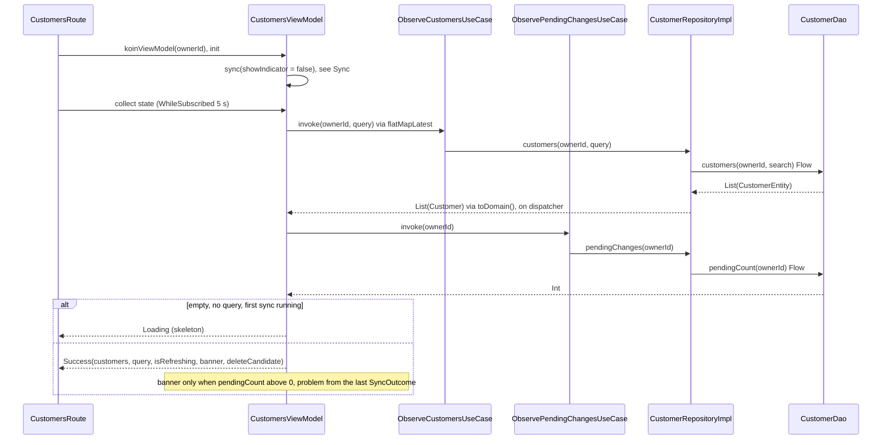
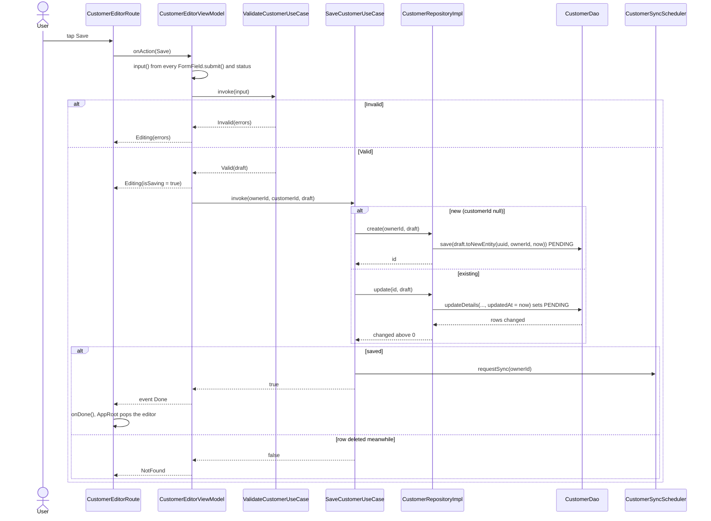
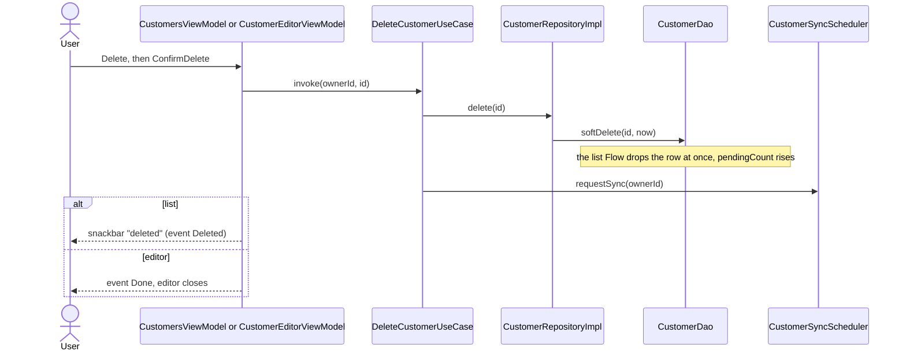
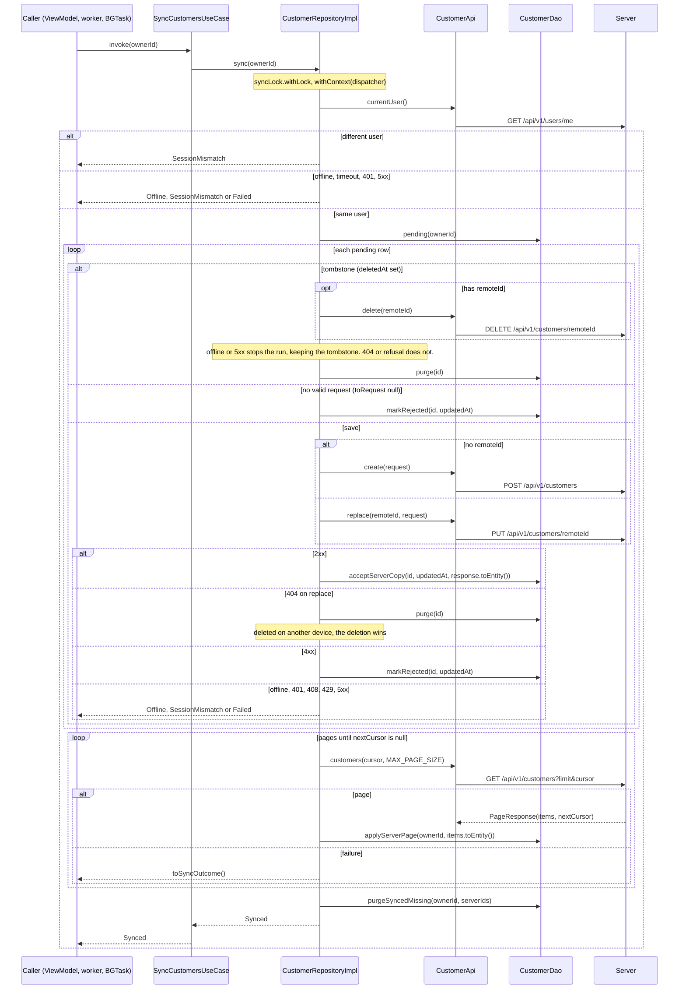
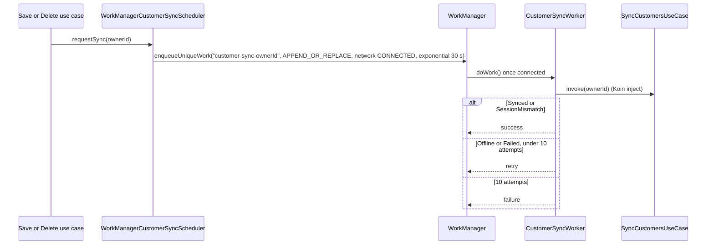
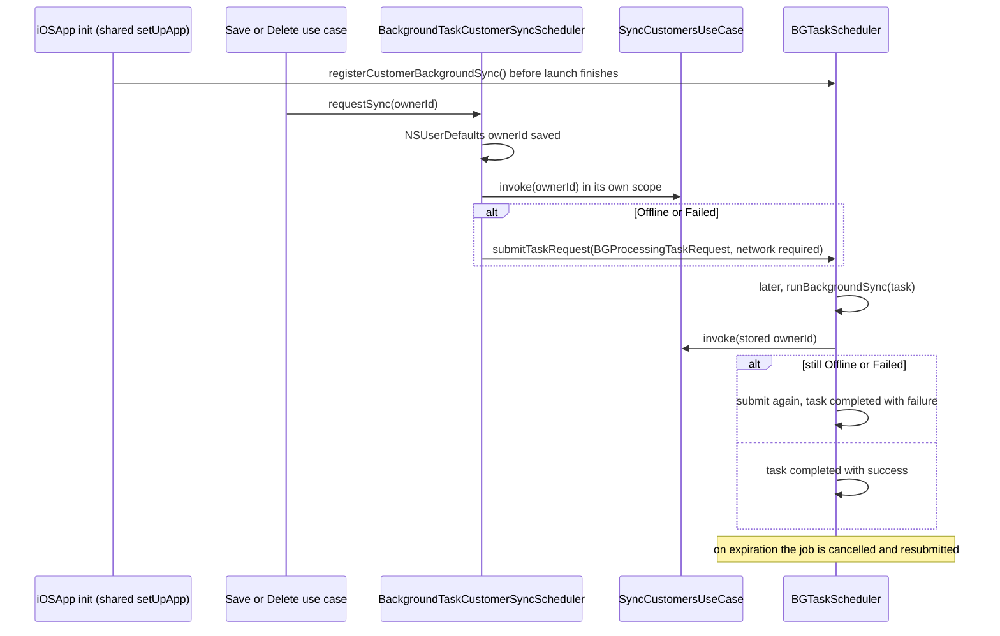

# feature:customers

The signed-in user's customers: a searchable list (the Home shell's Customers tab) and an editor,
offline-first. Every write lands in the local `customers` table as `PENDING` and a sync pushes it,
then pulls the server's pages; WorkManager (Android) or `BGTaskScheduler` (iOS) retries when
offline. Depends on `core:domain`, `core:ui`, `core:utils`, `core:network` and `core:database`
(whose `Customer` entity is imported here as `CustomerEntity`).

## Classes

### Presentation

```mermaid
classDiagram
    direction TB
    class CustomersRoute {
        <<composable>>
        +CustomersRoute(ownerId: String, onOpenEditor: (customerId: String?) -> Unit, modifier, viewModel: CustomersViewModel)
    }
    class CustomersScreen {
        <<composable>>
        +CustomersScreen(state: CustomersUiState, search: TextFieldState, onAction, snackbarHostState, modifier)
    }
    class CustomersViewModel {
        -ownerId: String
        +search: FormField
        +state: StateFlow~CustomersUiState~
        +events: SharedFlow~CustomersEvent~
        -syncStatus: MutableStateFlow~SyncStatus~
        -deleteCandidate: MutableStateFlow~Customer?~
        +onAction(action: CustomersAction)
        -sync(showIndicator: Boolean)
        -confirmDelete()
        -bannerFor(pendingCount: Int, outcome: SyncOutcome?) SyncBanner?
    }
    class CustomersUiState {
        <<sealed>>
        Loading
        Success(customers: List~Customer~, query: String, isRefreshing: Boolean, banner: SyncBanner?, deleteCandidate: Customer?)
    }
    class SyncBanner {
        <<data>>
        +pendingCount: Int
        +problem: SyncProblem?
    }
    class SyncProblem {
        <<enumeration>>
        OFFLINE
        FAILED
        SESSION_MISMATCH
    }
    class CustomersAction {
        <<sealed>>
        Refresh
        Add
        Open(customerId: String)
        Delete(customer: Customer)
        ConfirmDelete
        DismissDelete
    }
    class CustomersEvent {
        <<sealed>>
        OpenEditor(customerId: String?)
        Deleted
    }
    class CustomerEditorRoute {
        <<composable>>
        +CustomerEditorRoute(ownerId: String, customerId: String?, onDone: () -> Unit, modifier, viewModel: CustomerEditorViewModel)
    }
    class CustomerEditorScreen {
        <<composable>>
        +CustomerEditorScreen(state: CustomerEditorUiState, fieldState: (CustomerField) -> TextFieldState, onAction, modifier)
    }
    class CustomerEditorViewModel {
        -ownerId: String
        -customerId: String?
        +state: StateFlow~CustomerEditorUiState~
        +events: SharedFlow~CustomerEditorEvent~
        +fields: Map~CustomerField, FormField~
        +field(field: CustomerField) FormField
        +onAction(action: CustomerEditorAction)
        -load(id: String)
        -save()
        -delete()
    }
    class CustomerEditorUiState {
        <<sealed>>
        Loading
        NotFound
        Editing(isNew, status: CustomerStatus?, errors: Map~CustomerField, CustomerFieldError~, isRejected, isSaving, isConfirmingDelete)
    }
    class CustomerEditorAction {
        <<sealed>>
        StatusSelected(status: CustomerStatus)
        Save
        Delete
        ConfirmDelete
        DismissDelete
        Close
    }
    class CustomerEditorEvent {
        <<sealed>>
        Done
    }
    class FormField {
        <<core:ui>>
    }
    class ObserveCustomersUseCase
    class ObservePendingChangesUseCase
    class SyncCustomersUseCase
    class DeleteCustomerUseCase
    class GetCustomerUseCase
    class SaveCustomerUseCase
    class ValidateCustomerUseCase

    CustomersRoute --> CustomersViewModel : koinViewModel(parametersOf(ownerId))
    CustomersRoute --> CustomersScreen : renders
    CustomersScreen ..> CustomersAction : sends
    CustomersViewModel *-- CustomersUiState : combines into
    CustomersUiState *-- SyncBanner
    SyncBanner --> SyncProblem
    CustomersViewModel ..> CustomersEvent : emits
    CustomersViewModel *-- FormField : search
    CustomersViewModel --> ObserveCustomersUseCase : search results
    CustomersViewModel --> ObservePendingChangesUseCase : pending count
    CustomersViewModel --> SyncCustomersUseCase : on start and Refresh
    CustomersViewModel --> DeleteCustomerUseCase : ConfirmDelete
    CustomerEditorRoute --> CustomerEditorViewModel : koinViewModel(parametersOf(ownerId, customerId))
    CustomerEditorRoute --> CustomerEditorScreen : renders
    CustomerEditorScreen ..> CustomerEditorAction : sends
    CustomerEditorViewModel *-- CustomerEditorUiState : owns
    CustomerEditorViewModel ..> CustomerEditorEvent : emits
    CustomerEditorViewModel *-- FormField : one per text CustomerField
    CustomerEditorViewModel --> GetCustomerUseCase : load
    CustomerEditorViewModel --> ValidateCustomerUseCase : save
    CustomerEditorViewModel --> SaveCustomerUseCase : save
    CustomerEditorViewModel --> DeleteCustomerUseCase : ConfirmDelete
```

### Domain

```mermaid
classDiagram
    direction TB
    class CustomerRepository {
        <<interface>>
        +customers(ownerId: String, search: String) Flow~List~Customer~~
        +pendingChanges(ownerId: String) Flow~Int~
        +customer(id: String) Customer?
        +create(ownerId: String, draft: CustomerDraft) String
        +update(id: String, draft: CustomerDraft) Boolean
        +delete(id: String)
        +sync(ownerId: String) SyncOutcome
    }
    class CustomerSyncScheduler {
        <<fun interface>>
        +requestSync(ownerId: String)
    }
    class ObserveCustomersUseCase {
        +invoke(ownerId: String, search: String) Flow~List~Customer~~
    }
    class ObservePendingChangesUseCase {
        +invoke(ownerId: String) Flow~Int~
    }
    class GetCustomerUseCase {
        +invoke(id: String) Customer?
    }
    class SaveCustomerUseCase {
        +invoke(ownerId: String, id: String?, draft: CustomerDraft) Boolean
    }
    class DeleteCustomerUseCase {
        +invoke(ownerId: String, id: String)
    }
    class SyncCustomersUseCase {
        +invoke(ownerId: String) SyncOutcome
    }
    class ValidateCustomerUseCase {
        +invoke(input: CustomerInput) CustomerValidation
        -validateAddress(input, errors) CustomerAddress?
    }
    class Customer {
        <<data>>
        +id: String
        +details: CustomerDraft
        +syncState: SyncState
        +updatedAt: String
    }
    class CustomerDraft {
        <<data>>
        +firstName: String
        +lastName: String?
        +companyName: String?
        +email: String?
        +phone: String?
        +address: CustomerAddress?
        +notes: String?
        +status: CustomerStatus?
    }
    class SyncState {
        <<enumeration>>
        SYNCED
        PENDING
        REJECTED
    }
    class SyncOutcome {
        <<sealed>>
        Synced
        Offline
        SessionMismatch
        Failed
    }
    class CustomerInput {
        <<data>>
        raw text of every field + status: CustomerStatus?
    }
    class CustomerField {
        <<enumeration>>
        FIRST_NAME ... NOTES
        STATUS
    }
    class CustomerFieldError {
        <<sealed>>
        Required
        TooLong(maxLength: Int)
        InvalidEmail
        InvalidPhone
        InvalidCountryCode
    }
    class CustomerValidation {
        <<sealed>>
        Valid(draft: CustomerDraft)
        Invalid(errors: Map~CustomerField, CustomerFieldError~)
    }
    class CustomerAddress {
        <<api-contract>>
    }
    class CustomerStatus {
        <<api-contract>>
    }

    ObserveCustomersUseCase --> CustomerRepository : customers(ownerId, search.trim())
    ObservePendingChangesUseCase --> CustomerRepository
    GetCustomerUseCase --> CustomerRepository
    SyncCustomersUseCase --> CustomerRepository
    SaveCustomerUseCase --> CustomerRepository : create or update
    SaveCustomerUseCase --> CustomerSyncScheduler : requestSync if saved
    DeleteCustomerUseCase --> CustomerRepository : delete
    DeleteCustomerUseCase --> CustomerSyncScheduler : requestSync
    ValidateCustomerUseCase ..> CustomerValidation : returns
    ValidateCustomerUseCase --> CustomerInput : reads
    CustomerValidation --> CustomerField
    CustomerValidation --> CustomerFieldError
    Customer *-- CustomerDraft
    Customer --> SyncState
    CustomerDraft --> CustomerAddress
    CustomerDraft --> CustomerStatus
    CustomerRepository ..> SyncOutcome : sync returns
```

### Data

```mermaid
classDiagram
    direction TB
    class CustomerRepository {
        <<interface>>
    }
    class CustomerSyncScheduler {
        <<fun interface>>
    }
    class CustomerRepositoryImpl {
        -api: CustomerApi
        -dao: CustomerDao
        -dispatcher: CoroutineDispatcher
        -clock: Clock
        -newId: () -> String
        -syncLock: Mutex
        +sync(ownerId: String) SyncOutcome
        -checkSession(ownerId: String) SyncOutcome?
        -push(ownerId: String) SyncOutcome?
        -pushOne(ownerId: String, row: CustomerEntity) SyncOutcome?
        -pushDelete(row: CustomerEntity) SyncOutcome?
        -pushSave(ownerId: String, row: CustomerEntity) SyncOutcome?
        -pull(ownerId: String) SyncOutcome
    }
    class CustomerApi {
        -client: HttpClient
        +customers(cursor: String?, limit: Int) ApiResult~PageResponse~CustomerResponse~~
        +create(request: CustomerRequest) ApiResult~CustomerResponse~
        +replace(remoteId: String, request: CustomerRequest) ApiResult~CustomerResponse~
        +delete(remoteId: String) ApiResult~Unit~
        +currentUser() ApiResult~UserResponse~
    }
    class CustomerMapping {
        <<file>>
        ~CustomerEntity.toDomain() Customer
        ~CustomerDraft.toNewEntity(id: String, ownerId: String, now: String) CustomerEntity
        ~CustomerResponse.toEntity(ownerId: String) CustomerEntity
        ~CustomerEntity.toRequest() CustomerRequest?
        ~ApiError.toPushFailure() PushFailure
        ~ApiError.toSyncOutcome() SyncOutcome
    }
    class PushFailure {
        <<sealed, internal>>
        NotFound
        Rejected
        Stop(outcome: SyncOutcome)
    }
    class WorkManagerCustomerSyncScheduler {
        <<androidMain>>
        -workManager: WorkManager
        +requestSync(ownerId: String)
    }
    class CustomerSyncWorker {
        <<androidMain CoroutineWorker>>
        -syncCustomers: SyncCustomersUseCase
        +doWork() Result
        +KEY_OWNER_ID$
        +UNIQUE_NAME_PREFIX$
        -MAX_ATTEMPTS = 10$
    }
    class BackgroundTaskCustomerSyncScheduler {
        <<iosMain>>
        -syncCustomers: SyncCustomersUseCase
        -scope: CoroutineScope
        +requestSync(ownerId: String)
    }
    class BackgroundSync {
        <<iosMain file>>
        +CUSTOMER_SYNC_TASK_ID$
        +registerCustomerBackgroundSync()
        -runBackgroundSync(task: BGTask)
        -submitBackgroundSync()
    }
    class customerSyncPlatformModule {
        <<expect/actual koin module>>
        Android: WorkManagerCustomerSyncScheduler
        iOS: BackgroundTaskCustomerSyncScheduler
    }
    class customersModule {
        <<koin module>>
        includes customerSyncPlatformModule
        single CustomerApi, CustomerRepository
        factory use cases
        viewModel CustomersViewModel(ownerId), CustomerEditorViewModel(ownerId, customerId)
    }
    class CustomerDao {
        <<core:database>>
    }
    class CustomerEntity {
        <<core:database Customer>>
    }
    class HttpClient {
        <<core:network>>
    }

    CustomerRepositoryImpl ..|> CustomerRepository : implements
    CustomerRepositoryImpl --> CustomerDao : reads/writes
    CustomerRepositoryImpl --> CustomerApi : sync
    CustomerRepositoryImpl --> CustomerMapping : maps
    CustomerMapping ..> PushFailure
    CustomerMapping ..> CustomerEntity
    CustomerApi --> HttpClient : sends
    WorkManagerCustomerSyncScheduler ..|> CustomerSyncScheduler : implements
    WorkManagerCustomerSyncScheduler ..> CustomerSyncWorker : enqueues unique work
    BackgroundTaskCustomerSyncScheduler ..|> CustomerSyncScheduler : implements
    BackgroundTaskCustomerSyncScheduler --> BackgroundSync : submitBackgroundSync on retry
    customersModule --> customerSyncPlatformModule : includes
```

## Sequences

### Open the list

The tab composes, the ViewModel starts a silent sync, and the list renders from Room as soon as
it has rows. Search is debounced 300 ms (0 when cleared).

### Save a customer

Local first: the row is written `PENDING` and the screen closes. The sync scheduler sends it.

### Delete a customer

From the list (the row's delete button, then confirm) or the editor (Delete, confirm). A soft delete is a tombstone the
next sync pushes, then purges.

### Sync

One run at a time (`syncLock`). Session check, then push every pending row in `updatedAt` order,
then pull every page. Whatever stops it is the `SyncOutcome`.

### Background retry (Android)

### Background retry (iOS)

