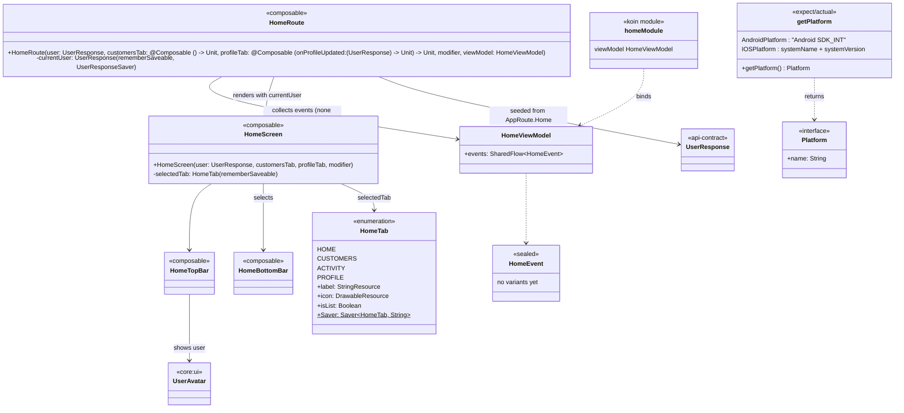
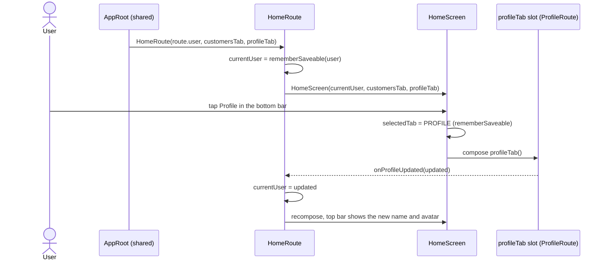

# feature:home

The signed-in shell: a glass top bar, a floating bottom navigation pill and whichever tab is
selected. The Customers and Profile tabs are slots `shared`'s `App.kt` fills, so this module never
imports another feature. Depends on `core:domain`, `core:ui` and `core:utils`.

## Classes

## Sequences

### Switch tabs and keep the account current

The `AppRoute.Home` key holds the user as it was at sign-in. `HomeRoute` keeps its own saveable
copy that the Profile tab updates, so a rename doesn't rebuild the entry and lose the tab.

