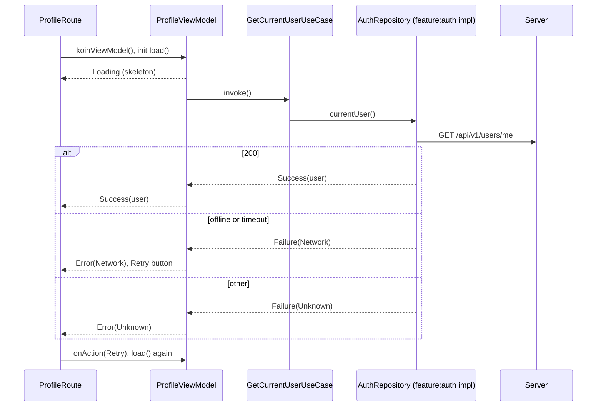
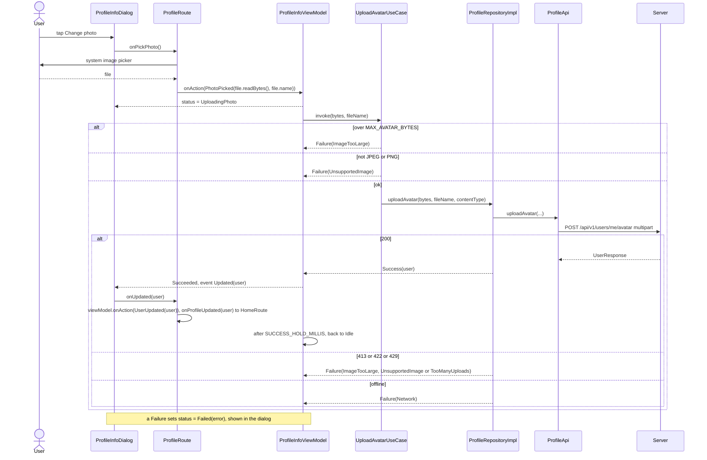
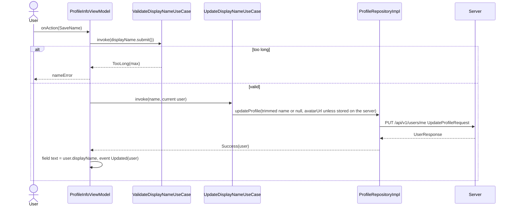
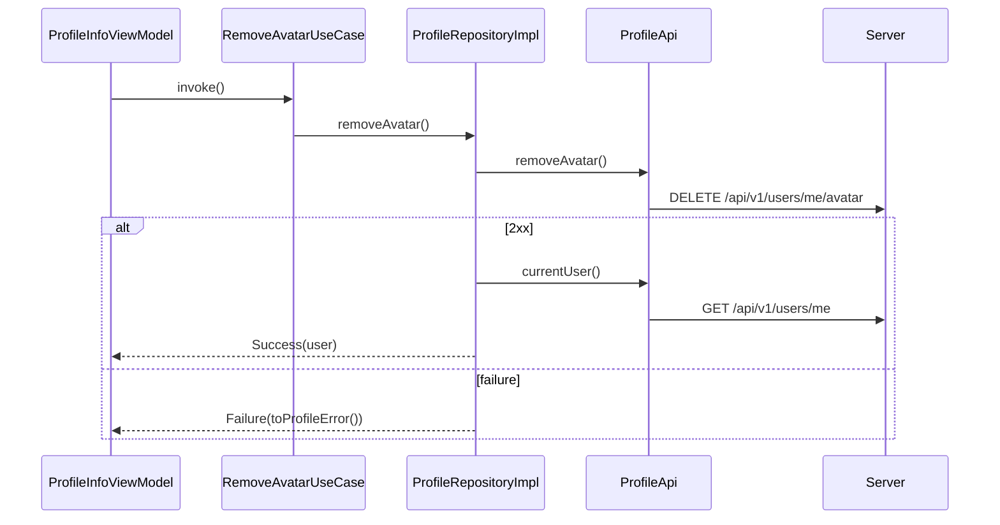
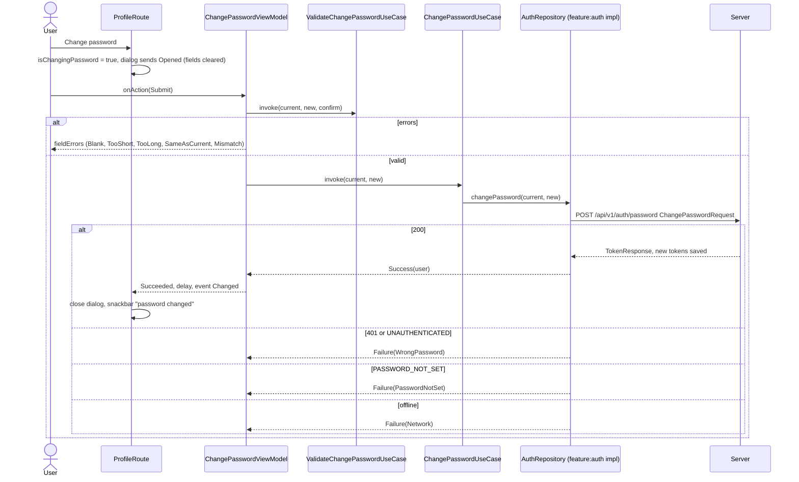
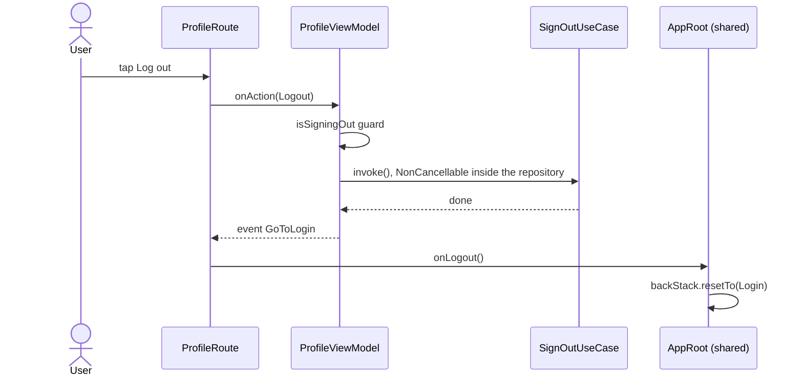

# feature:profile

The Profile tab: the account header, linked providers, sign-out, and two dialogs — edit profile
(display name, avatar upload and removal) and change password. Reads the user through
`core:domain`'s `AuthRepository`; writes the profile through its own `ProfileApi`. Depends on
`core:domain`, `core:ui`, `core:utils` and `core:network`; FileKit for the photo picker.

## Classes

### Presentation

```mermaid
classDiagram
    direction TB
    class ProfileRoute {
        <<composable>>
        +ProfileRoute(onLogout: () -> Unit, onProfileUpdated: (UserResponse) -> Unit, modifier, viewModel: ProfileViewModel, editViewModel: ProfileInfoViewModel)
        -isChangingPassword: Boolean (rememberSaveable)
        -isEditingProfile: Boolean (rememberSaveable)
        -photoPicker: FileKit launcher
    }
    class ProfileScreen {
        <<composable>>
        +ProfileScreen(state: ProfileUiState, onAction, snackbarHostState, modifier)
    }
    class ProfileViewModel {
        +state: StateFlow~ProfileUiState~
        +events: SharedFlow~ProfileEvent~
        -isSigningOut: Boolean
        +onAction(action: ProfileAction)
        -load()
        -logout()
    }
    class ProfileUiState {
        <<sealed>>
        Loading
        Success(user: UserResponse)
        Error(error: AuthError)
    }
    class ProfileAction {
        <<sealed>>
        Logout
        EditProfile
        ChangePassword
        UserUpdated(user: UserResponse)
        Retry
    }
    class ProfileEvent {
        <<sealed>>
        GoToLogin
        OpenChangePassword
        OpenEditProfile
    }
    class ProfileInfoDialog {
        <<composable>>
        +ProfileInfoDialog(user: UserResponse, onPickPhoto: () -> Unit, onUpdated: (UserResponse) -> Unit, onDismiss: () -> Unit, viewModel: ProfileInfoViewModel)
    }
    class ProfileInfoViewModel {
        +uiState: StateFlow~ProfileInfoUiState~
        +events: SharedFlow~ProfileInfoEvent~
        +displayName: FormField
        +onAction(action: ProfileInfoAction)
        -saveName()
        -write(running: ProfileInfoStatus, call: suspend () -> AuthResult)
        -onSaved(user: UserResponse, wroteTheName: Boolean)
    }
    class ProfileInfoUiState {
        <<data>>
        +user: UserResponse?
        +typedName: String
        +nameError: DisplayNameError?
        +status: ProfileInfoStatus
        +isBusy, isNameDirty, hasPhoto, willClearPhoto: Boolean
        +error: AuthError?
    }
    class ProfileInfoStatus {
        <<sealed>>
        Idle
        SavingName
        UploadingPhoto
        RemovingPhoto
        Succeeded
        Failed(error: AuthError)
    }
    class ProfileInfoAction {
        <<sealed>>
        Opened(user: UserResponse)
        SaveName
        PhotoPicked(bytes: ByteArray, fileName: String)
        RemovePhoto
        Close
    }
    class ProfileInfoEvent {
        <<sealed>>
        Updated(user: UserResponse)
        Dismissed
    }
    class ChangePasswordDialog {
        <<composable>>
        +ChangePasswordDialog(onDismiss: () -> Unit, onChanged: () -> Unit, viewModel: ChangePasswordViewModel)
    }
    class ChangePasswordViewModel {
        +uiState: StateFlow~ChangePasswordUiState~
        +events: SharedFlow~ChangePasswordEvent~
        +currentPassword: FormField
        +newPassword: FormField
        +confirmPassword: FormField
        +onAction(action: ChangePasswordAction)
        -submit()
    }
    class ChangePasswordUiState {
        <<data>>
        +isCurrentVisible: Boolean
        +isNewVisible: Boolean
        +fieldErrors: ChangePasswordErrors
        +status: ChangePasswordStatus
        +isBusy: Boolean
        +error: AuthError?
    }
    class ChangePasswordStatus {
        <<sealed>>
        Idle
        Submitting
        Succeeded
        Failed(error: AuthError)
    }
    class ChangePasswordAction {
        <<sealed>>
        Opened
        ToggleCurrentVisibility
        ToggleNewVisibility
        Submit
        Cancel
    }
    class ChangePasswordEvent {
        <<sealed>>
        Dismissed
        Changed
    }
    class GetCurrentUserUseCase
    class SignOutUseCase {
        <<core:domain>>
    }
    class UpdateDisplayNameUseCase
    class UploadAvatarUseCase
    class RemoveAvatarUseCase
    class ValidateDisplayNameUseCase
    class ChangePasswordUseCase
    class ValidateChangePasswordUseCase

    ProfileRoute --> ProfileViewModel : collects state, events
    ProfileRoute --> ProfileScreen : renders
    ProfileRoute --> ProfileInfoDialog : hosts, when Success and isEditingProfile
    ProfileRoute --> ChangePasswordDialog : hosts, when isChangingPassword
    ProfileRoute --> ProfileInfoViewModel : PhotoPicked from the picker
    ProfileScreen ..> ProfileAction : sends
    ProfileViewModel *-- ProfileUiState
    ProfileViewModel ..> ProfileEvent : emits
    ProfileViewModel --> GetCurrentUserUseCase : load
    ProfileViewModel --> SignOutUseCase : logout
    ProfileInfoDialog --> ProfileInfoViewModel : same entry-scoped instance
    ProfileInfoViewModel *-- ProfileInfoUiState
    ProfileInfoUiState *-- ProfileInfoStatus
    ProfileInfoViewModel ..> ProfileInfoEvent : emits
    ProfileInfoViewModel --> ValidateDisplayNameUseCase
    ProfileInfoViewModel --> UpdateDisplayNameUseCase
    ProfileInfoViewModel --> UploadAvatarUseCase
    ProfileInfoViewModel --> RemoveAvatarUseCase
    ChangePasswordDialog --> ChangePasswordViewModel
    ChangePasswordViewModel *-- ChangePasswordUiState
    ChangePasswordUiState *-- ChangePasswordStatus
    ChangePasswordViewModel ..> ChangePasswordEvent : emits
    ChangePasswordViewModel --> ValidateChangePasswordUseCase
    ChangePasswordViewModel --> ChangePasswordUseCase
```

### Domain and data

```mermaid
classDiagram
    direction TB
    class GetCurrentUserUseCase {
        -authRepository: AuthRepository
        +invoke() AuthResult
    }
    class ChangePasswordUseCase {
        -authRepository: AuthRepository
        +invoke(currentPassword: String, newPassword: String) AuthResult
    }
    class ValidateChangePasswordUseCase {
        +invoke(currentPassword: String, newPassword: String, confirmPassword: String) ChangePasswordErrors
    }
    class UpdateDisplayNameUseCase {
        -profileRepository: ProfileRepository
        +invoke(displayName: String, current: UserResponse) AuthResult
    }
    class UploadAvatarUseCase {
        -profileRepository: ProfileRepository
        +invoke(bytes: ByteArray, fileName: String) AuthResult
    }
    class RemoveAvatarUseCase {
        -profileRepository: ProfileRepository
        +invoke() AuthResult
    }
    class ValidateDisplayNameUseCase {
        +invoke(displayName: String) DisplayNameError?
    }
    class ChangePasswordErrors {
        <<data>>
        +currentPassword: PasswordError?
        +newPassword: PasswordError?
        +confirmPassword: PasswordError?
        +hasErrors: Boolean
        +NONE$
    }
    class DisplayNameError {
        <<sealed>>
        TooLong(maxLength: Int)
    }
    class ImageBytes {
        <<file>>
        ~ByteArray.avatarContentType() String?
    }
    class ProfileRepository {
        <<interface>>
        +updateProfile(displayName: String?, avatarUrl: String?) AuthResult
        +uploadAvatar(bytes: ByteArray, fileName: String, contentType: String) AuthResult
        +removeAvatar() AuthResult
    }
    class ProfileRepositoryImpl {
        -profileApi: ProfileApi
        -dispatcher: CoroutineDispatcher
    }
    class ProfileApi {
        -client: HttpClient
        +updateProfile(displayName: String?, avatarUrl: String?) ApiResult~UserResponse~
        +uploadAvatar(bytes: ByteArray, fileName: String, contentType: String) ApiResult~UserResponse~
        +removeAvatar() ApiResult~Unit~
        +currentUser() ApiResult~UserResponse~
    }
    class ProfileMapping {
        <<file>>
        ~ApiError.toProfileError() AuthError
    }
    class profileModule {
        <<koin module>>
        single ProfileApi, ProfileRepository
        factory use cases
        viewModel ProfileViewModel, ChangePasswordViewModel, ProfileInfoViewModel
    }
    class AuthRepository {
        <<core:domain>>
    }
    class HttpClient {
        <<core:network>>
    }

    GetCurrentUserUseCase --> AuthRepository : currentUser
    ChangePasswordUseCase --> AuthRepository : changePassword
    ValidateChangePasswordUseCase ..> ChangePasswordErrors : returns
    ValidateDisplayNameUseCase ..> DisplayNameError : returns
    UpdateDisplayNameUseCase --> ProfileRepository : keeps a non-stored avatarUrl
    UploadAvatarUseCase --> ImageBytes : JPEG or PNG only
    UploadAvatarUseCase --> ProfileRepository : uploadAvatar
    RemoveAvatarUseCase --> ProfileRepository : removeAvatar
    ProfileRepositoryImpl ..|> ProfileRepository : implements
    ProfileRepositoryImpl --> ProfileApi : calls
    ProfileRepositoryImpl --> ProfileMapping : maps errors
    ProfileApi --> HttpClient : sends
```

## Sequences

### Load the profile

### Upload an avatar

The picker lives in the route (FileKit must be remembered in a stable scope); its result goes
straight to the same `ProfileInfoViewModel` the dialog uses.

### Save the display name

### Remove the avatar

### Change password

### Sign out

