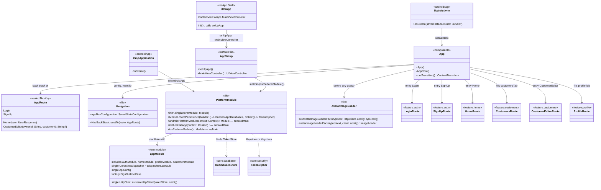
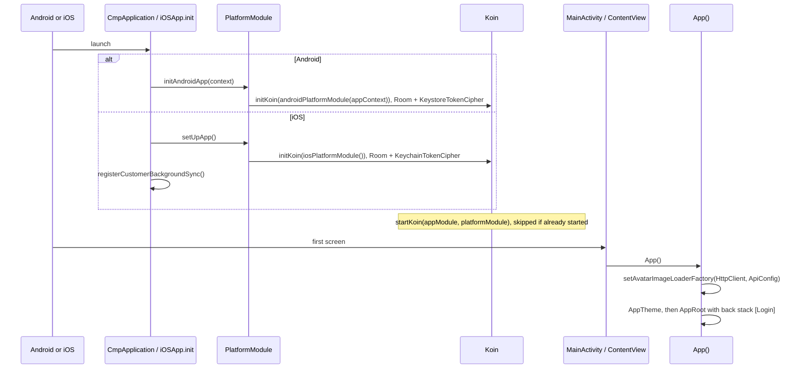
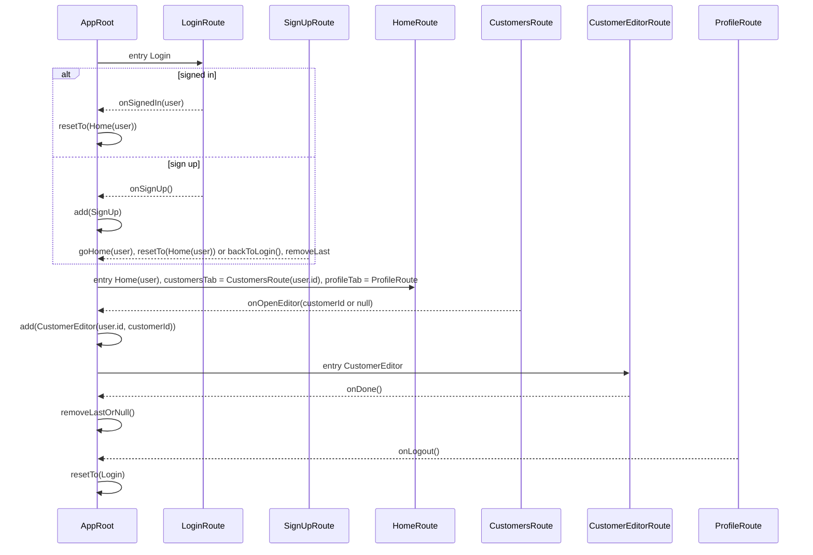

# shared

The app module, and the only place features meet: `App()` and `AppRoot` (Navigation 3 back stack
and routes), the Koin graph (`appModule` plus a platform module that builds Room and picks the
token cipher), the Coil avatar `ImageLoader`, and the iOS entry points. Depends on every `core`
and `feature` module. The platform shells — `androidApp` (`CmpApplication`, `MainActivity`) and
`iosApp` (`iOSApp`, `ContentView`) — only call into it, and are drawn here too.

## Classes

## Sequences

### Start the app

### Navigate

Screens report outcomes; `AppRoot` owns the back stack. Each entry gets its own saveable state and
`ViewModelStore`, so leaving an entry disposes its ViewModels.

